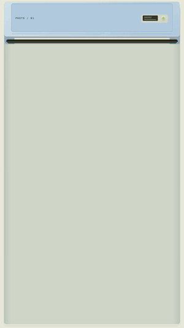
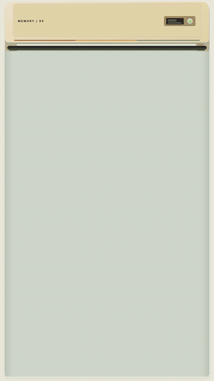

# Printer Effect

**Turn images and videos into printer and instant-camera animations — locally, without an API key.**

[中文说明](README.zh-CN.md) · [Gallery](examples/GALLERY.md) · [Full configuration](references/config.md) · [Troubleshooting](references/troubleshooting.md)

## Preview gallery

| Modern printer | Retro printer · snowflake collage | Instant camera |
| --- | --- | --- |
|  |  |  |

[View all effects and runnable examples →](examples/GALLERY.md)

## What you can make

| Mode | Look and sequence |
| --- | --- |
| Modern printer | Clean case, centered tray, gradual paper feed |
| Retro printer | Vintage case, warm colors, mechanical printing |
| Instant camera | Photorealistic unbranded camera, shutter click, flash, blank film ejection, development |

Choose 4:3, 9:16, 1:1, 3:4 or 16:9. End with a hold, row, flyout, stack, grid or snowflake photo collage. Videos stay frozen while printing, then play. Instant cameras include **pink, matcha, white and pale blue**, plus ivory. Printing flashes green; completion turns red.

## Start here: your first video

Download the release ZIP and extract it, or download this repository through GitHub **Code → Download ZIP**. Open a terminal inside the extracted `printer-effect` directory. You need **Python 3.10+, Node.js 22+ with npm, FFmpeg and ffprobe**, available on PATH.

macOS / Linux:

```bash
python3 -m venv .venv
source .venv/bin/activate
python -m pip install -r requirements.txt
python scripts/cli.py setup
python scripts/cli.py doctor
python scripts/cli.py render --config examples/modern-flyout.json --output output/first-video
```

Windows PowerShell (activation is not required):

```powershell
py -3 -m venv .venv
.venv\Scripts\python.exe -m pip install -r requirements.txt
.venv\Scripts\python.exe scripts/cli.py setup
.venv\Scripts\python.exe scripts/cli.py doctor
.venv\Scripts\python.exe scripts/cli.py render --config examples/modern-flyout.json --output output/first-video
```

Open `output/first-video/renders/printer-effect.mp4`. The example image is included. The same folder contains `cover.jpg`; the project includes editable settings and diagnostic logs. In the commands below, `python` means the virtual-environment Python above.

Initial setup/render needs internet access to download npm packages and potentially the browser runtime. This is local rendering, not an offline installer. No image-generation account, API key or paid rendering service is required for the bundled modes.

## Ready-to-run recipes

```bash
# Modern printer, 4:3
python scripts/cli.py render --config examples/modern-flyout.json --output output/modern
# Retro printer, several photos, 9:16, snowflake collage
python scripts/cli.py render --config examples/retro-snowflake.json --output output/retro
# Pale-blue instant camera, 4:3, 90% camera width, 18 seconds
python scripts/cli.py render --config examples/instant-blue-landscape.json --output output/blue
# Pink instant camera, portrait
python scripts/cli.py render --config examples/instant-pink-portrait.json --output output/pink
```

Also included: [matcha camera](examples/instant-matcha.json), [white camera](examples/instant-white.json), [grid](examples/modern-grid.json), [stack](examples/retro-stack.json). See the [gallery](examples/GALLERY.md) for output frames and reproduction commands.

## Use your own media

```bash
python scripts/cli.py render "my photo.heic" --style instant --color matcha --aspect 9:16 --camera-width 90% --duration 18 --ending flyout --output output/my-photo
python scripts/cli.py render "photos/" --style retro --color cream --aspect 9:16 --ending snowflake --output output/my-album
python scripts/cli.py render "clip.mp4" --style modern --aspect 4:3 --source-audio --ending flyout --output output/my-video
```

Images: PNG, JPEG, WebP, HEIC/HEIF, TIFF. Videos: MP4, MOV, M4V. Folder input uses natural filename ordering, without recursion. Use `--cover "photos/cover.jpg"` to move an included file to the front. Add `--silent` to mute shutter/motor; omit `--source-audio` to keep source-video audio off. Videos play a three-second excerpt by default; set per-file `play_seconds` and `media_start` in JSON for more control.

### Sizing without surprises

- `--aspect 4:3` sets the output canvas, **not** the photo crop. 4:3 exports 1920×1440; 9:16 exports 1440×2560 at 30 fps by default.
- `--camera-width 90%` controls the instant-camera body only. Proportions stay fixed. Portrait default is 90%; landscape default is smaller unless explicitly overridden.
- `--width 90%` is the photo content-box target. Actual photo size also depends on the output slot, image ratio and available space. Read `layout-report.json` for the measured width.
- A large single instant camera moves upward while ejecting if necessary, keeping the film wide and proportional. Part of the camera leaves the frame intentionally; the photo remains complete. Multi-photo layouts do not use this single-photo lift.
- `contain` preserves the complete picture. `--fit cover` explicitly permits cropping. `flyout` enlarges the finished print for display.

### Colors and endings

Photo-real instant camera: `ivory`, `white` / 白色, `pink` / 粉色, `matcha` / 抹茶, `light-blue` / 淡蓝色. Other palettes (`cream`, `mint`, `black`, `silver`, `red`) and custom `#RRGGBB` use the rendered camera design. `blue` is an alias for the pale-blue palette. Modern/retro support all palettes.

| Ending | Behavior |
| --- | --- |
| hold | Keep one completed print |
| row | Park several prints below the machine |
| flyout | Lift and enlarge each photograph in turn |
| stack | Overlapping photo stack |
| grid | Readable regular arrangement |
| snowflake | Radial scattered photo collage; not falling snow particles |

Above 12 photos, row/stack/snowflake switch to paginated grid with a note. Up to 100 inputs are accepted; large batches need longer durations. Impossible durations are rejected rather than silently cutting scenes.

## Edit, preview and render again

```bash
python scripts/cli.py build --config examples/instant-blue-landscape.json --output output/editable
python scripts/cli.py preview --config examples/instant-blue-landscape.json --output output/preview
python scripts/cli.py render --config output/blue/printer-config.json --color pink --duration 20 --output output/blue --revision
```

`build` creates a project without a video; `preview` creates/checks a project and opens the local timeline; `render` creates/checks/exports. Existing output folders are protected; `--revision` creates a numbered sibling. For direct edits to generated HTML, run its pinned `npm run check` and `npm run render` inside the generated project. The main CLI builds from settings and does not preserve manual HTML edits.

For development time, flash, custom resolution, sound and per-file video options, see the [full configuration reference](references/config.md). CLI flags override JSON; media paths in JSON resolve relative to the JSON file.

## Install as a Codex skill

Copy the **complete project folder** to `~/.codex/skills/printer-effect` (or `$CODEX_HOME/skills/printer-effect`), run setup there, and start a fresh Codex session. Do not copy only SKILL.md. Keep assets, scripts, package files and references together. Windows uses the corresponding directory under your user profile.

Try:

> Use $printer-effect: pale-blue instant camera, 4:3, camera width 90%, 18 seconds. Use the attached photo and finish with a flyout.

> 打印机效果，复古奶油色，9:16，按附件顺序打印，最后雪花拼贴。

The CLI also works without Codex. Other agent-host integrations are not verified.

## Privacy, licensing and verification

This repository includes synthetic fixtures, contributor-approved travel demo images and AI-generated, unbranded camera visualizations. Cameras are not photographs of actual branded products. Original shutter/motor audio is synthesized locally. Only the explicitly approved travel examples are included; unrelated personal media is excluded. See [sample media terms](examples/media/travel/README.md). Generated projects **contain copies of input media**: review before sharing. npm/HyperFrames have their own network and telemetry behavior; this project's code does not upload media or publish repositories.

Source and synthetic fixtures: [MIT](LICENSE). Third-party dependencies retain their licenses, including GSAP; see [notices](THIRD_PARTY_NOTICES.md). Tested locally on macOS Apple Silicon. CI is configured for Python checks on macOS/Linux/Windows and a Linux render smoke test; configured CI is not a claim that remote runs have passed.

## Development and releases

```bash
python -m unittest discover -s tests -v
python scripts/package_release.py --output dist/printer-effect.zip
```

See [contributing](CONTRIBUTING.md), [changelog](CHANGELOG.md), and [troubleshooting](references/troubleshooting.md). The release archive excludes virtual environments, node_modules, caches and private output projects. Extracted releases still require the setup steps above.

## Date/time postmark / 日期时间邮戳

Both printers and instant cameras add a postal-style date/time mark by default. A new run captures Beijing date and time (seconds), fixed UTC+8 regardless of host timezone; no timezone label is printed once; preview and render use the same value. Saved configs preserve it for reproducible revisions. Remove timestamp_text from a saved config to capture a new time. `--no-timestamp` or JSON `timestamp:false` disables it. JSON `timestamp_text` accepts up to 100 characters, with `|` separating two display lines. This is a decorative printed-at time, not the original photo capture date or an official postal mark.

打印机和拍立得默认添加邮戳式日期时间：本次生成时的北京时间日期和时分秒（固定东八区，不受电脑时区影响，画面不显示UTC）。预览与导出固定一致；旧配置保留原值，删除timestamp_text后可获取新时间。`--no-timestamp`或JSON `timestamp:false`可关闭。`timestamp_text`最多100字符，使用`|`分成两行。它表示生成时间，不是照片拍摄时间，也不是官方邮戳。

## Travel photo recipes / 旅行照片示例

```bash
python scripts/cli.py render --config examples/travel-poster.json --output output/poster
python scripts/cli.py render --config examples/travel-snowflake.json --output output/album
```
