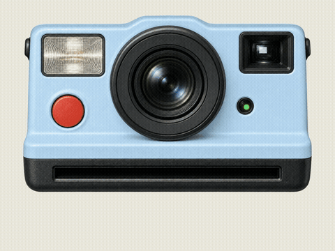

# Printer Effect · 打印机与拍立得动画

**把照片、海报或视频，变成带声音的打印机出纸／拍立得显影动画。支持本地渲染，无需 API Key。**

[English](README.md) · [效果画廊](examples/GALLERY.md) · [完整参数](references/config.zh-CN.md) · [常见问题](references/troubleshooting.zh-CN.md)



## 能做什么

| 样式 | 效果 |
| --- | --- |
| 现代打印机 `modern` | 简洁机身、对齐托盘、照片逐渐打印出来 |
| 复古打印机 `retro` | 复古外观、奶油等配色、机械出纸效果 |
| 拍立得 `instant` | 拟真相机、快门声与闪光、白边相纸吐出、渐进显影 |

支持 4:3、9:16、1:1、3:4、16:9；支持照片停留、排成一行、飞出放大、堆叠、网格和雪花拼贴。视频会先以静态画面打印，完成后再播放。拍立得支持**粉色、抹茶、白色、淡蓝色**以及象牙白。打印时绿灯闪烁，结束后红灯常亮。

## 第一次使用：复制命令即可生成示例

下载发布 ZIP 并解压，或使用 GitHub 的 **Code → Download ZIP**。在解压后的 `printer-effect` 文件夹打开终端。先安装 **Python 3.10+、Node.js 22+（含 npm）、FFmpeg（含 ffprobe）**，并确保可在终端找到它们。

macOS / Linux：

```bash
python3 -m venv .venv
source .venv/bin/activate
python -m pip install -r requirements.txt
python scripts/cli.py setup
python scripts/cli.py doctor
python scripts/cli.py render --config examples/modern-flyout.json --output output/first-video
```

Windows PowerShell（无需激活虚拟环境）：

```powershell
py -3 -m venv .venv
.venv\Scripts\python.exe -m pip install -r requirements.txt
.venv\Scripts\python.exe scripts/cli.py setup
.venv\Scripts\python.exe scripts/cli.py doctor
.venv\Scripts\python.exe scripts/cli.py render --config examples/modern-flyout.json --output output/first-video
```

成品：`output/first-video/renders/printer-effect.mp4`；同目录还有封面 `cover.jpg`。示例图片已附带，第一次无需准备自己的照片。下文中的 `python` 指上述虚拟环境内的 Python。

首次安装或渲染需要联网下载依赖及可能需要的浏览器运行环境；这不是离线安装包。不需要图像生成账号、API Key 或付费云渲染服务。

## 开箱即用的示例

```bash
# 现代蓝色打印机，4:3，照片飞出
python scripts/cli.py render --config examples/modern-flyout.json --output output/modern
# 复古奶油色，多张照片，9:16，雪花拼贴
python scripts/cli.py render --config examples/retro-snowflake.json --output output/retro
# 淡蓝色拍立得，4:3，相机宽90%，18秒
python scripts/cli.py render --config examples/instant-blue-landscape.json --output output/blue
# 粉色拍立得，9:16
python scripts/cli.py render --config examples/instant-pink-portrait.json --output output/pink
```

还有[抹茶拍立得](examples/instant-matcha.json)、[白色拍立得](examples/instant-white.json)、[网格](examples/modern-grid.json)、[堆叠](examples/retro-stack.json)。[效果画廊](examples/GALLERY.md)提供实际渲染截图及对应命令。

## 换成自己的图片或视频

```bash
python scripts/cli.py render "我的照片.heic" --style instant --color matcha --aspect 9:16 --camera-width 90% --duration 18 --ending flyout --output output/my-photo
python scripts/cli.py render "照片文件夹/" --style retro --color cream --aspect 9:16 --ending snowflake --output output/my-album
python scripts/cli.py render "视频.mp4" --style modern --aspect 4:3 --source-audio --ending flyout --output output/my-video
```

- 图片：PNG、JPEG、WebP、HEIC/HEIF、TIFF；视频：MP4、MOV、M4V。
- 文件夹按文件名自然排序，不递归读取子文件夹。`--cover "照片文件夹/封面.jpg"` 将已包含的文件移到第一位。
- `--silent` 关闭快门与出纸声；原视频声音默认关闭，`--source-audio` 开启。
- 视频默认播放 3 秒片段；JSON 中的 `play_seconds`、`media_start` 可指定片段时长和开始位置。
- 使用包含空格的文件名时加双引号。JSON 中的路径以该 JSON 文件所在目录为基准。

## 尺寸怎么选

**画面比例、相机宽度、照片宽度是三个独立设置。**

| 参数 | 含义 |
| --- | --- |
| `--aspect 4:3` | 成品画面比例；默认导出1920×1440 |
| `--aspect 9:16` | 竖屏成品；默认导出1440×2560 |
| `--camera-width 90%` | 拍立得机身宽度；始终保持比例，不压扁镜头 |
| `--width 90%` | 照片内容区域的目标宽度；受出纸口及原图比例约束 |
| `--fit contain` | 默认完整保留图片 |
| `--fit cover` | 允许裁切，以填满区域 |

拍立得竖屏默认相机宽90%；横屏默认机身较小，需要时显式指定90%。单张照片遇到横屏空间不足时，相机会随出纸上移，部分机身移出画面，为匹配出纸口宽度的相纸让出空间；多图模式不使用这个单图上移动作。`flyout` 会在出纸后进一步放大照片。实际图片宽度见 `layout-report.json`，不会用拉伸原图的方式凑满。

## 配色与结尾

拟真拍立得：`pink`／粉色、`matcha`／抹茶、`white`／白色、`light-blue`／淡蓝色、`ivory`／象牙白。`blue` 与淡蓝色是同一配色。其他预设 `cream`、`mint`、`black`、`silver`、`red` 和自定义 `#RRGGBB` 使用立体绘制相机外观。现代／复古打印机支持所有配色。

| 结尾 | 效果 |
| --- | --- |
| `hold` | 单张打印完成后停留 |
| `row` | 多张照片依次放到下方 |
| `flyout` | 照片依次飞出、放大展示 |
| `stack` | 照片叠放 |
| `grid` | 网格排版 |
| `snowflake` | 照片呈放射状散落拼贴，不是下雪粒子 |

超过12张时，row／stack／snowflake 会转为分页网格并提示。最多100个输入；照片越多越需要足够时长。不合理的总时长会明确报错，不会偷偷删减照片。

## 预览、修改、重新生成

```bash
python scripts/cli.py build --config examples/instant-blue-landscape.json --output output/editable
python scripts/cli.py preview --config examples/instant-blue-landscape.json --output output/preview
python scripts/cli.py render --config output/blue/printer-config.json --color pink --duration 20 --output output/blue --revision
```

`build` 只建项目；`preview` 建项目、检查并打开本地时间线；`render` 建项目、检查并导出视频。已有目录不会被覆盖；`--revision` 自动生成带编号的新目录。若直接修改生成项目的 HTML，应在该项目内运行 `npm run check`、`npm run render`；主 CLI 会根据配置重新生成，不保留手改 HTML。

显影时长、闪光开关、自定义分辨率、声音和逐文件参数见[完整参数说明](references/config.zh-CN.md)。命令行参数优先于 JSON。

## 安装为 Codex 技能

将**整个项目目录**复制到 `~/.codex/skills/printer-effect`，或 `$CODEX_HOME/skills/printer-effect`，在该目录执行安装步骤，再开启新的 Codex 会话。不要只复制 SKILL.md。Windows 放在用户目录对应的技能路径。

直接说：

> 淡蓝色拍立得，4:3，相机宽90%，18秒，使用附件图片，最后飞出放大。

> 打印机效果，复古奶油色，9:16，按附件顺序打印，最后雪花拼贴。

也可以通过 `$printer-effect` 显式调用。无需 Codex 也能通过 CLI 使用；其他智能体平台的安装方式未验证。

## 隐私、授权与兼容性

公开示例使用项目自带的几何演示图片、提供者明确允许用于示例的旅行图片，以及 AI 生成的无品牌相机素材；并非真实品牌产品照片。声音由程序合成。发布包仅包含明确获准的旅行示例，其他私人素材不包含在内；参见[示例素材说明](examples/media/travel/README.md)。**生成的项目包含原始输入文件副本**，分享前应检查。项目本身不上传素材或发布仓库；npm／HyperFrames 有各自的联网和遥测行为。

源码和演示素材遵循 [MIT](LICENSE)；第三方依赖保留各自许可，详见[依赖声明](THIRD_PARTY_NOTICES.md)。已在 macOS Apple Silicon 本地验证。配置了 macOS／Linux／Windows 单元测试及 Linux 渲染 CI，但不代表远程 CI 已实际运行通过。

## 开发和打包

```bash
python -m unittest discover -s tests -v
python scripts/package_release.py --output dist/printer-effect.zip
```

参见[参与开发](CONTRIBUTING.md)、[变更记录](CHANGELOG.md)、[常见问题](references/troubleshooting.zh-CN.md)。发布包排除虚拟环境、node_modules、缓存和私人输出项目；接收者仍需执行上述安装步骤。

## Date/time postmark / 日期时间邮戳

Both printers and instant cameras add a postal-style date/time mark by default. A new run captures Beijing date and time (seconds), fixed UTC+8 regardless of host timezone; no timezone label is printed once; preview and render use the same value. Saved configs preserve it for reproducible revisions. Remove timestamp_text from a saved config to capture a new time. `--no-timestamp` or JSON `timestamp:false` disables it. JSON `timestamp_text` accepts up to 100 characters, with `|` separating two display lines. This is a decorative printed-at time, not the original photo capture date or an official postal mark.

打印机和拍立得默认添加邮戳式日期时间：本次生成时的北京时间日期和时分秒（固定东八区，不受电脑时区影响，画面不显示UTC）。预览与导出固定一致；旧配置保留原值，删除timestamp_text后可获取新时间。`--no-timestamp`或JSON `timestamp:false`可关闭。`timestamp_text`最多100字符，使用`|`分成两行。它表示生成时间，不是照片拍摄时间，也不是官方邮戳。

## Travel photo recipes / 旅行照片示例

```bash
python scripts/cli.py render --config examples/travel-poster.json --output output/poster
python scripts/cli.py render --config examples/travel-snowflake.json --output output/album
```
