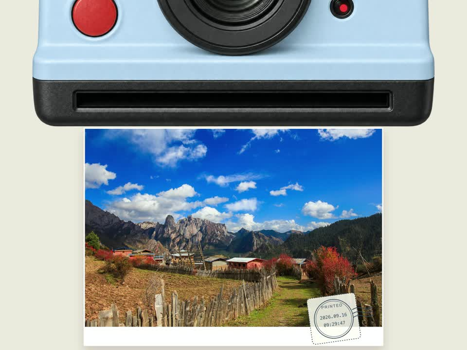
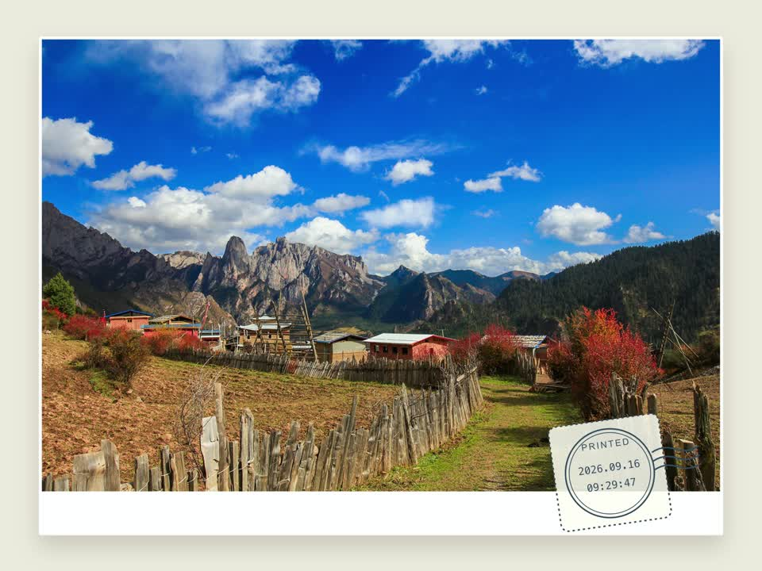
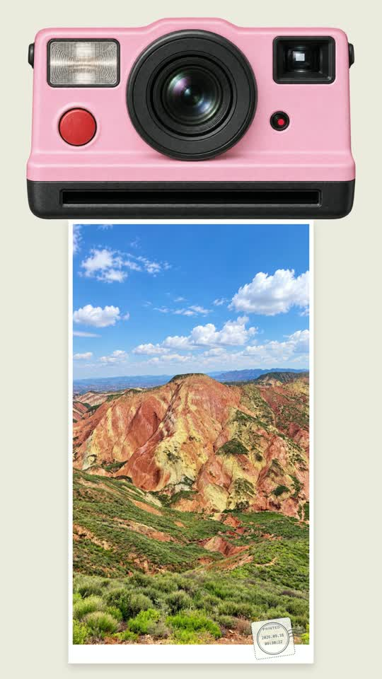
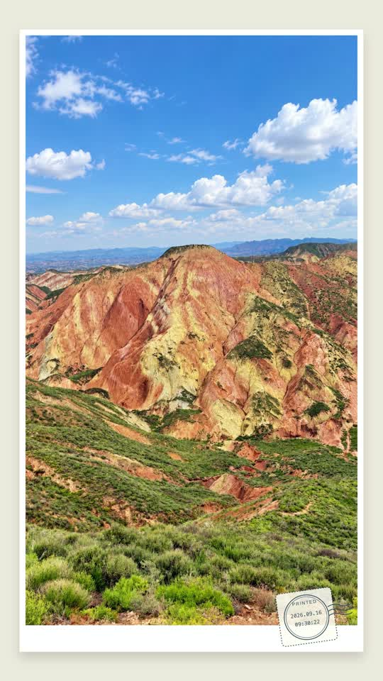
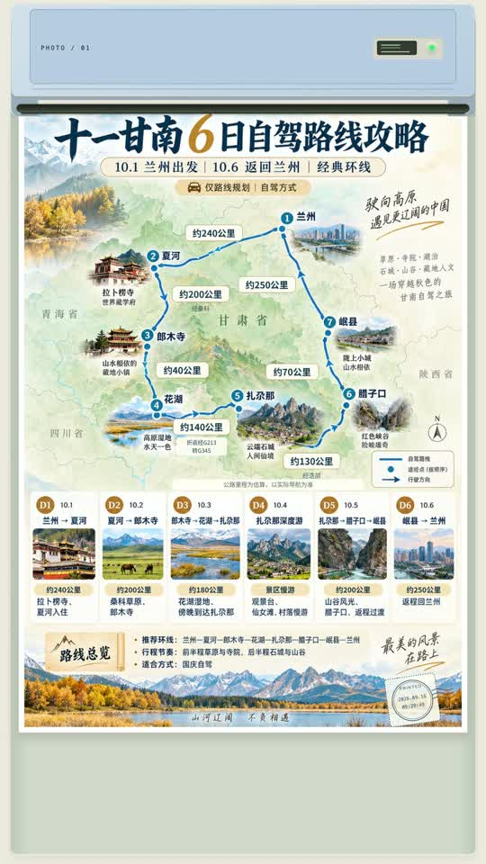
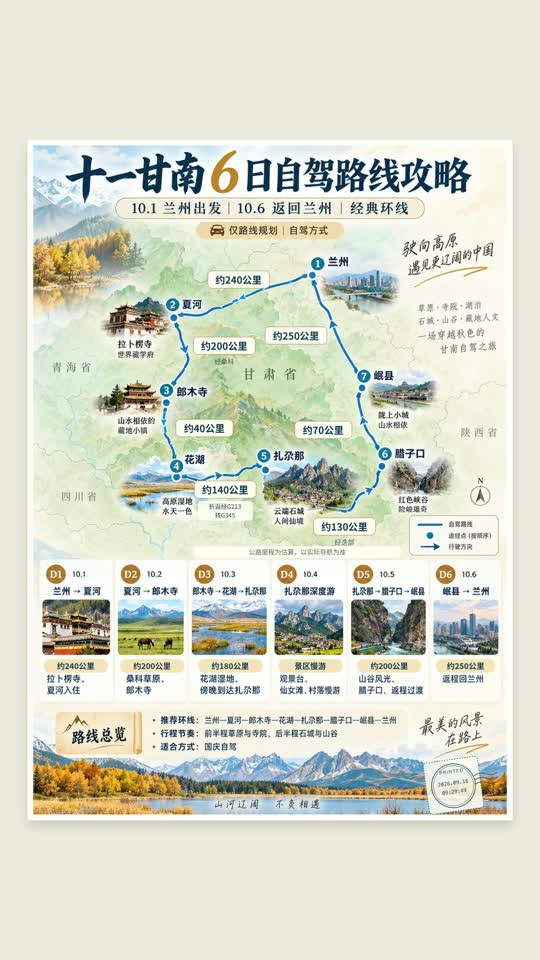
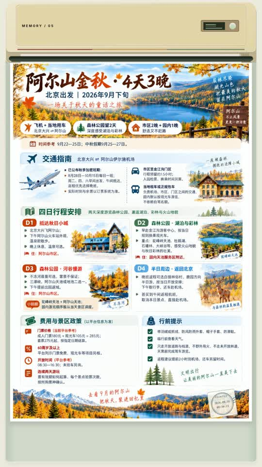
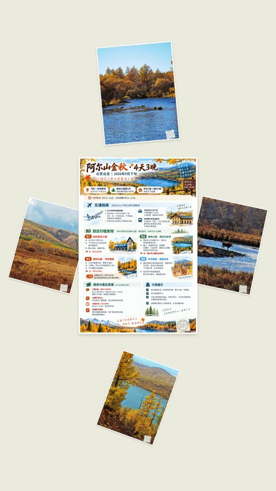
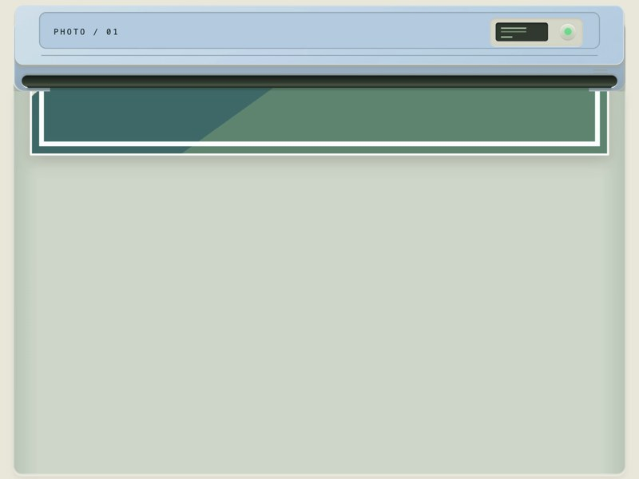
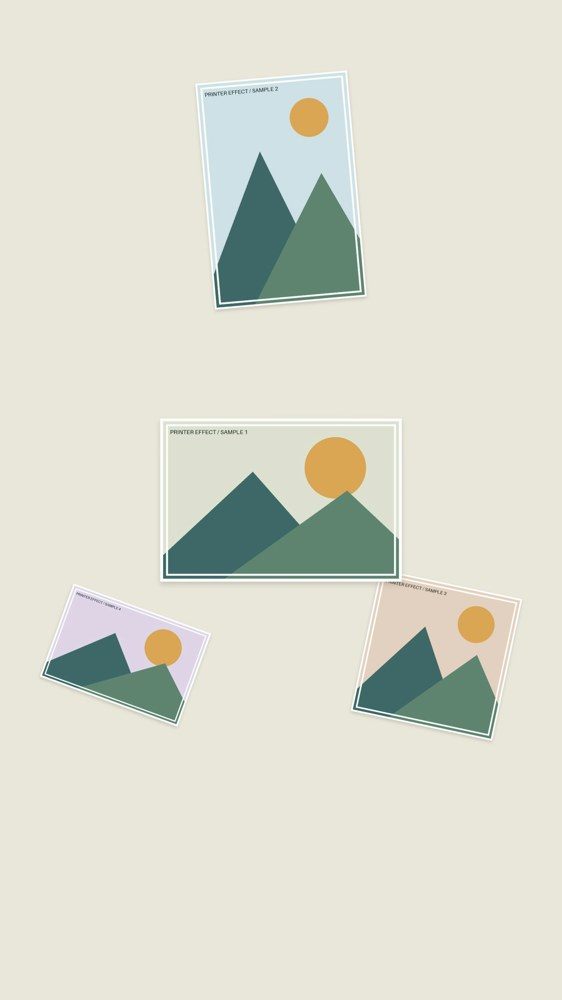

# Gallery / 效果画廊

[English guide](../README.md) · [中文说明](../README.zh-CN.md)

Actual frames from locally rendered videos. The travel photos and posters were supplied and approved as project examples; see [media notes](media/travel/README.md). Commands use bundled inputs and can be run from the project root after setup. Date/time stamps reflect each run's Beijing generation time.

以下为真实渲染截图。使用随项目附带、已获准作为示例的旅行图片。安装完成后在项目根目录运行命令即可复现；邮戳时间按每次生成时间变化。

## Pale-blue instant camera / 淡蓝色拍立得 · 4:3 · 18s


| Developed print / 显影完成 | Flyout / 飞出放大 |
| --- | --- |
|  |  |

```bash
python scripts/cli.py render --config examples/instant-blue-landscape.json --output output/blue
```

Camera width is 90%. Film fits the physical slot; the large camera moves upward as paper ejects to free vertical space. 快门声、闪光、显影及邮戳均包含；横屏出纸时相机会部分移出上边缘。

## Pink instant camera / 粉色拍立得 · 9:16 · 18s

| Developed print / 显影完成 | Flyout / 飞出放大 |
| --- | --- |
|  |  |

```bash
python scripts/cli.py render --config examples/instant-pink-portrait.json --output output/pink
```

More colors / 更多配色: [matcha 抹茶](instant-matcha.json), [white 白色](instant-white.json). The body stays proportional across colors.

## Modern poster printer / 现代打印机 · 9:16 · 18s

| Printing / 打印 | Finished / 完成 |
| --- | --- |
|  |  |

```bash
python scripts/cli.py render --config examples/travel-poster.json --output output/poster
```

## Retro travel album / 复古打印机 · 9:16 · 36s

| Printing / 打印 | Snowflake collage / 雪花拼贴 |
| --- | --- |
|  |  |

```bash
python scripts/cli.py render --config examples/travel-snowflake.json --output output/album
```

First the itinerary poster, then four autumn photographs. Snowflake means radial photo arrangement, not snow particles. 行程图在前，随后四张秋景，最后散落拼贴。

## Synthetic fixtures / 几何测试样例

These simple fixtures remain available for tests without travel media. 以下示例便于检查布局。

| Modern / 现代 | Retro / 复古 |
| --- | --- |
|  |  |

```bash
python scripts/cli.py render --config examples/modern-flyout.json --output output/modern
python scripts/cli.py render --config examples/retro-snowflake.json --output output/retro
```

Other layouts / 其他布局: [grid 网格](modern-grid.json), [stack 堆叠](retro-stack.json). Above twelve pictures, certain endings switch to paginated grid for readability.
